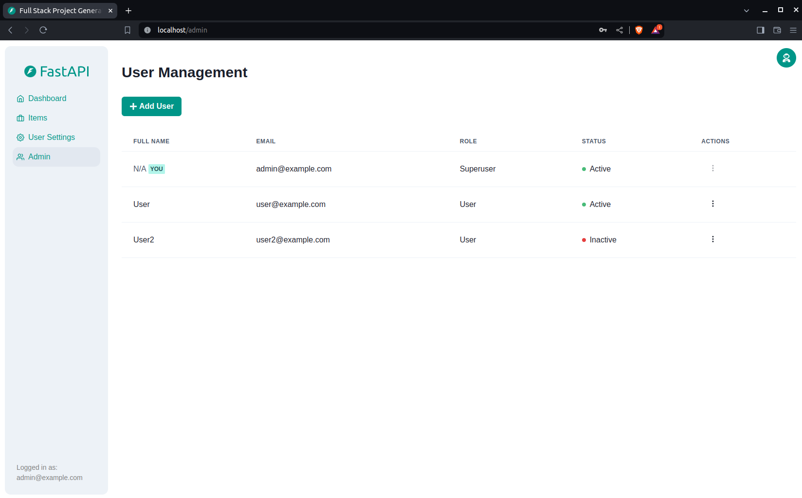

# The California Accountability Panel web application

California Accountability Panel is a dashboard for displaying key school performance metric. Contributions are welcome!

> [!NOTE]
> Learn about the project on the [documentation website](https://opensacorg.github.io/app-capanel-doc) (under development).

## Overview

1. Search for a school or school district. 
3. Explore test scores and standards. 
4. Get detailed breakdowns. 

> [!NOTE]
> Academic performance data for 2024 and 2025 can be downloaded in a zip file on Nate's google drive https://drive.google.com/drive/folders/1ifRu7gL8OVxN7oHKadEydS3e7c85ityr?usp=sharing.

## Contribute

The easiest way to get started is to use the [Docker](https://www.docker.com/) container (under development). If you want to contribute to the project, it is recommended to install the PostgreSQL, Python and Node.js requirements and run each part separately. For help, see the [developer documentation](https://app-capanel-web.readthedocs.io/en/latest/developer/).

For support and to keep updated on news:

- Attend a virtual [Community Hack Night](https://www.meetup.com/opensacorg).
- Join our [Slack channel (updated 2026-02-01)](https://join.slack.com/t/opensacorg/shared_invite/zt-3orx8kjdj-8gULmv2wuTHhAUxUt9SY8A).
- Email us at info@opensac.org or info@innovateforcalifornia.org.

## Self-hosting with Docker

All parts of the application can be started by running `docker compose up`. **Before the first run**, make sure to update the configs in the `.env` files to customize your configurations. For help, see [deployment documentation](https://app-capanel-web.readthedocs.io/en/latest/developer/).

The minimum required environment variables are:

```env
SECRET_KEY=changethis
FIRST_SUPERUSER=admin@example.com
FIRST_SUPERUSER_PASSWORD=changethis
POSTGRES_PASSWORD=changethis
```

View [all environment variables](https://app-capanel-web.readthedocs.io/en/latest/developer/#environment-variables).

On first Docker startup, the `prestart` job now also attempts to import academic indicator data using:

- `backend/app/scripts/import_ela_data.py`
- `backend/app/scripts/import_indicators.py`

For local development (`compose.override.yml`), mount or place files under `backend/resources/` (default expected folder: `backend/resources/cde`).

Optional `.env` controls:

```env
RUN_DATA_IMPORTS=true
IMPORT_ELA_DATA_FILE=/app/backend/resources/cde/eladownload2025.xlsx
IMPORT_INDICATORS_SOURCE=cde
IMPORT_INDICATORS_PATH=/app/backend/resources/cde
IMPORT_INDICATORS_INDICATOR=
IMPORT_INDICATORS_BATCH_SIZE=1000
```

Imports are skipped automatically if `academicindicator` already has rows, to avoid duplicate inserts on restart.

Detached mode (`docker compose up -d`) does not stream container logs. To see live import progress from prestart (including heartbeat messages while files parse), run:

```bash
docker compose logs -f prestart
```

### Generate Secret Keys

Some environment variables in the `.env` file have a default value of `changethis`.

You have to change them with a secret key, to generate secret keys you can run the following command:

```bash
python -c "import secrets; print(secrets.token_urlsafe(32))"
```

Copy the content and use that as password / secret key. And run that again to generate another secure key.

### Cloud hosting providers

Cloud Run + Cloud SQL support is available through `backend/app/scripts/deploy_cloud_run.py`.
Runtime secrets for Cloud Run are sourced from GCP Secret Manager:

- `capanel-secret-key` -> `SECRET_KEY`
- `capanel-postgres-password` -> `POSTGRES_PASSWORD`

`FIRST_SUPERUSER` and `FIRST_SUPERUSER_PASSWORD` stay local `.env` values for local development and are not managed in Secret Manager.

For Cloud Run, deploy now supports syncing local resources from `~/Downloads/resources` to GCS before image deploy:

```env
IMPORT_RESOURCES_LOCAL_PATH=~/Downloads/resources
IMPORT_GCS_URI=gs://ca-panel-001-resources/resources
SYNC_LOCAL_IMPORTS_TO_BUCKET=true
```

## Database modes

### Local development (manual backend run)

By default, running:

```bash
uv run --env-file .env backend/app/main.py
```

uses local Postgres from `.env`:

```env
DB_CONNECTION_MODE=auto
POSTGRES_SERVER=localhost
POSTGRES_PORT=5432
POSTGRES_DB=capanel_f65b
POSTGRES_USER=nateb
POSTGRES_PASSWORD=...
```

`DB_CONNECTION_MODE=auto` selects local Postgres in `ENVIRONMENT=local`/`staging` when `POSTGRES_SERVER` is set, and prefers Cloud SQL in `ENVIRONMENT=production` when `CLOUD_SQL_INSTANCE_CONNECTION_NAME` is set.
You can force behavior with:

```env
DB_CONNECTION_MODE=local
# or
DB_CONNECTION_MODE=cloudsql
```

### Local development (Docker + local Postgres container)

Use:

```bash
docker compose up --build
```

This starts the `db` Postgres container and configures backend services to use it.

### Production (Cloud SQL for Postgres)

Backend supports Cloud SQL via either:

```env
CLOUD_SQL_INSTANCE_CONNECTION_NAME=ca-panel-001:us-west1:capanel-pg
POSTGRES_DB=capanel
POSTGRES_USER=capanel_app
# POSTGRES_PASSWORD is injected at runtime from Secret Manager in Cloud Run
```

or:

```env
DATABASE_URL=postgresql+psycopg://USER:PASSWORD@/DB?host=/cloudsql/PROJECT:REGION:INSTANCE
```

## Deploy to Google Cloud Run

1. Set Cloud Run values in your local `.env` file.
2. Create/update runtime secrets in Secret Manager:

```bash
python backend/app/scripts/create_secrets.py
```

3. Load env vars and run:

```bash
set -a
source .env
set +a
python backend/app/scripts/provision_cloud_run.py
python backend/app/scripts/deploy_cloud_run.py
```

Notes:

- Cloud Run deploy uses one service (`capanel-full`) with two containers:
  - `frontend` (NGINX ingress on `8080`)
  - `backend` sidecar (FastAPI on `8000`)
- The `${BACKEND_SERVICE}-init` Cloud Run Job is deployed and never auto-executed during deploy.
- The init job runs only `backend/app/scripts/initial_data.py`.
- A manual HTTP Cloud Function `${INIT_TRIGGER_FUNCTION_NAME}` is deployed and can trigger the init job on demand.
- Ensure callers have `roles/cloudfunctions.invoker` on the trigger function.

Suggested Google Cloud resource names:

- Artifact Registry repository: `capanel-repo` (region: `us-west1`)
- Cloud SQL instance: `capanel-pg` (PostgreSQL 18, private IP only, network `default`)
- Cloud SQL database: `capanel`
- Cloud SQL user: `capanel_app`
- Cloud Run full service: `capanel-full`
- Backend image name (Artifact Registry): `capanel-backend`
- Frontend image name (Artifact Registry): `capanel-frontend`
- Runtime service account: `capanel-runner@ca-panel-001.iam.gserviceaccount.com`
- Private services IP range: `google-managed-services-default`

## Security

We strive to make this application secure as possible. Some highlights include:

- Hashed passwords.
- Based on an actively maintained open-source project (full-stack-fastapi-postgres). We can mimic the versions of the pyproject dependencies and know when things need upgrading.

### Security concerns

The application does not enforce https by default. You can enable it by setting `SECURE_SSL_REDIRECT` to `True` in the `.env` file.

See [Security.md](Security.md) for more information on reporting security vulnerabilities. For other security related topics see the [security documentation page](https://app-capanel-web.readthedocs.io/en/latest/security/). You can also email info@opensac.org.

# Other resources

- [Documentation repository](https://github.com/opensacorg/app-capanel-doc)
